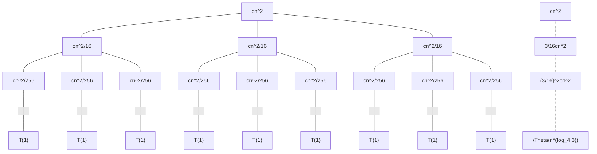

---
export_on_save:
    puppeteer: true
---

    算法设计与分析第二章作业 
    苏亦凡&emsp;&emsp;计科12班&emsp;&emsp;200111229

## 1

用 $O$、$\Omega$、$\Theta$ 表示函数 $f$ 与 $g$ 之间阶的关系，并分别指出下列函数中阶最低和最高的函数：（该题考察阶的关系，20分）

(1) $f(n)=100$，$g(n)=\sqrt[100]{n}$

- $f(n)=O(g(n))$

(2) $f(n)=6n+n\lfloor\log n\rfloor$，$g(n)=3n$

- $f(n)=\Omega(g(n))$

(3) $f(n)=\frac{n}{\log n}-1$，$g(n)=2\sqrt{n}$

- $f(n)=\Omega(g(n))$

(4) $f(n)=2^n+n^2$，$g(n)=3^n$

- $f(n)=O(g(n))$

(5) $f(n)=\log_3 n$，$ g(n)=\log_2 n$

- $f(n)=\Theta(g(n))$

阶最低函数：$f(n)=100$  
阶最高函数：$g(n)=3^n$

## 2

证明：$\sum\limits_{k=1}^{\infty} \cfrac 1 {k^2}$ 有常数上界。（该题考察和式求和，20分）

当$k-1 \le x \le k$ 时，有 $\cfrac 1 {k^2} \le \cfrac 1 {x^2}$，故：
$$ \frac 1 {k^2} < \int_{k-1}^{k} \frac{1}{x^2}dx,(k=2,3 \cdots) $$

故有：
$$\sum\limits_{k=1}^{\infty} \cfrac 1 {k^2}<1+\int_{1}^\infty \frac{1}{x^2}dx=2$$

故$\sum\limits_{k=1}^{\infty} \cfrac 1 {k^2}$ 有常数上界。

## 3

给出下列各式中 $T(n)$ 的渐近上下界，假设当 $n \le 10$ 时， $T(n)$ 为常数，尽可能保证给出的界限是紧的，并验证给出的答案。（该题考察递归方程解法，20分）

### 3.1

$T(n)=3T(n/5)+\lg^2 n$

**使用master定理**  
$a=3,b=5,f(n)=\lg^2 n,n^{\log_ba}=n^{\log_5 3},\log_53\approx0.683$  
有$f(n)=O(n^{\log_ba-\epsilon}),(0<\epsilon<log_ba)$  
故$T(n)=\Theta(n^{\log_5 3})$

### 3.2

$T(n) = T(\sqrt{n})+\Theta(\lg\lg n)$

令$m=\lg n$，有$T(2^m) = T(2^{m/2})+\Theta(\lg m)$

令$S(m)=T(w^m)$，得$S(m) = S(m/2)+\Theta(\lg m)$

令$q=\lg m,Q(q)=S(2^q)$，得$Q(q)=Q(q-1)+\Theta(q)$。

易得$Q(q)=\Theta(q^2)$，$Q(q)=S(m)=T(n)$，$q=\lg\lg n$。

最终得到：$T(n)=\Theta((\lg\lg n)^2)$

### 3.3

$T(n)=10T(n/3)+17n^{1.2}$

**使用master定理**  
$a=10,b=3,f(n)=17n^{1.2},n^{\log_ba}=n^{\log_3 10},\log_3 10\approx 2.10$  
有$f(n)=O(n^{1.2})=O(n^{\log_ba-\epsilon}),取\epsilon=0.8$  
故$T(n)=\Theta(n^{\log_3 10})$

### 3.4

$T(n) = 7T(n/2) + n^3$

**使用master定理**  
$a=7,b=2,f(n)=n^3,n^{\log_ba}=n^{\log_2 7},\log_2 7\approx 2.80$  
有$f(n)=\Omega(n^{\log_3 7+\epsilon}),取\epsilon=0.1$  
正则条件：$af(n/b)=\frac{7}{8}n^3$，取$c=\frac{7}{8}$即可满足。  
故$T(n)=\Theta(n^3)$

### 3.5

$T(n) = T(n/2+\sqrt{n})+\sqrt{6046}$

显然存在$n_0$使得$n>n_0$时有$\frac{1}{4}n>\sqrt{n}$  
即$T(n/2)<T(n/2+\sqrt{n})<T(3n/4)$

用master定理计算$T_1(n) = T_1(n/2)+\sqrt{6046}$与$T_2(n) = T_2(3n/4)+\sqrt{6046}$，可得：$T_1(n)=\Theta(\lg n),T_2(n)=\Theta(\lg n)$

故应有$T(n)=\Theta(\lg n)$

## 4
<!-- $a=,b=,f(n)=,n^{\log_ba}=n^{\log},\log\approx $   -->
运用主定理求解下面方程，假设 $T$ 为 $O(1)$ 作为基本情况：（该题考察主定理，20分）

### 4.1

$T(n) = 25T(n/5)+n^{2.1}$

$a=25,b=5,f(n)=n^{2.1},n^{\log_ba}=n^2$  
有$f(n)=\Theta(n^{2+0.1})$  
故$T(n)=\Theta(n^{2.1})$

### 4.2

$T(n) = 25T(n/5) + n^{1.5}$

$a=25,b=5,f(n)=n^{1.5},n^{\log_ba}=n^2$  
有$f(n)=\Theta(n^{2-0.5})$  
故$T(n)=\Theta(n^{2})$

### 4.3

$T(n) = 25T(n/5) + n^{2}$

$a=25,b=5,f(n)=n^{2},n^{\log_ba}=n^2$  
有$f(n)=\Theta(n^{2})$  
故$T(n)=\Theta(n^{2}\lg n)$

## 5

对递归式 $T(n) = 3T(n/4) + cn^2$，用递归法确定一个渐进上界，并画出递归树。

可能会用到的公式：$a^{\log b^c} = c^{\log b^a}$（该题考察递归树，20分）

$$ \begin{aligned} T(n) = & cn^2 + \frac 3 {16}cn^2 + (\frac 3 {16})^2cn^2 + \cdots + (\frac 3 {16})^{\log_4 (n - 1)}cn^2 + \Theta(n^{\log_4 3}) \\ = & \sum_{i=0}^{\log_4 (n - 1)}(\frac 3 {16})^icn^2 + \Theta(n^{\log_4 3}) \\ = & \frac {(\frac 3 {16})^{\log_4 n}-1}{\frac 3 {16} -1}cn^2 + \Theta(n^{\log_4 3}) \end{aligned} $$

猜想：$T(n)=O(n^2)$。代入验证：

使用第二数学归纳法。假设当$n<k$时，命题成立。即存在$d>0$，当$n<k时$有
$$ T(n)\le dn^2 \tag{1}$$

当$n=k$时，有：
$$ T(n)=3T(n/4) + cn^2\le 3dn^2/16+cn^2=(3/16d+c)n^2 $$
令$d\le \frac{16}{13}c$，有：
$$ T(n)\le dn^2 \tag{2}$$

由式(1)(2)有$T(n)=O(n^2)$成立。
