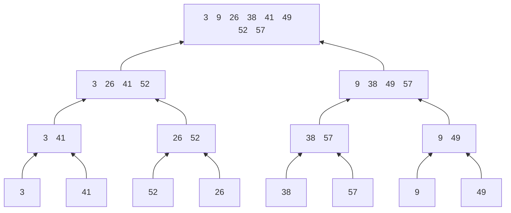

---
export_on_save:
    puppeteer: true
---
<center>
    算法设计与分析第三章作业<br>
    苏亦凡&emsp;&emsp;计科12班&emsp;&emsp;200111229
</center>

# 1

以下是快速排序中的一种 PARTITION 方法的伪代码及过程：

`PARTITION(A,p,r)`
```{.line-numbers}
x <- A[r]
i <- p-1
for j <- p to r-1
    do if A[j] <= x
        then i <- i+1
            exchange A[i] <-> A[j]
exchange A[i+1] <-> A[r]
return i+1
```
<center></center>

仿照上图说明PARTITION过程作用于数组A=<13,19,9,5,12,4,7,8>的过程。

答：

<center></center>

# 2

以下图为模型，说明合并排序在输入数组A = < 3,41,52,26,38,57,9,49 >上的执行过程。

<center></center>

答：



# 3

假设 $A$ 和 $B$ 是长度为 $n$ 排好序的数组，且数组中每个数都是不同的。

## 3.1

设计一个算法，在 $O(\log n)$ 时间里找出这 $2n$ 个数的中位数，其中 $2n$ 个数的中位数为从小到大排序的第 $n$ 个数。

答：

不妨设两序列为 A,B 序列，且为升序排列。求两序列的中位数。若median(A)=median(B)，则此值为两序列的并的中位数。若不相等，则舍去中位数较小的序列较小的一半，较大序列较大的一半(需保证舍去的个数相同，并可以不包含原序列中位数)。对现在的两序列进行如上比较。若两序列都只剩下1个元素，则取较小的元素。

伪代码如下：
```c{.line-numbers}
headA <- 0
tailA <- n-1
headB <- 0
tailB <- n-1

while (headA!=tailA || headB!=tailB)
    midA <- (headA+tailA)/2
    midB <- (headB+tailB)/2

    if A[midA] == B[midB] then return A[midA]
    else if A[midA] < B[midB] then
            tailB <- midB
            headA <- midA
            if !((tailA - headA + 1) % 2) then headA ++
            
            else
            tailA <- midA
            headB <- midB
            if !((tailA - headA + 1) % 2) then headB ++

return min(A[headA],B[headB])
```

## 3.2

证明你的算法复杂度为 $O(\log n)$。

答：

算法实际上是一递归算法，设算法时间复杂度为$T(n)$，解决这个问题需要解决一个规模为$\lceil n/2\rceil$的子问题，而分解步骤的时间复杂度为常数级$\Theta(1)$。

$$ T(n)=T(n/2)+\Theta(1) $$

使用master定理。  
$a=1,b=2,f(n)=\Theta(n),\log_b a=0$，故$n^{\log_b a}=\Theta(1)$，得：$T(n)=\Theta(\log n)$，显然有$T(n)=O(\log n)$。

# 4

$n$ 枚硬币，其中有一枚是假币，己知假币的重量较轻。现只有一个天平，要求用尽量少的比较次数找出这枚假币。我们用 `f(A,first,last)` 函数来完成上述功能。请写出该函数的伪代码 (其中 A 表示硬币数组 [1..n]，first,last 为当前考虑的硬币数组中的第一个和最后一个下标，函数返回值为假币的下标)。

答：

设天平操作为`weight(A,ls,le,rs,re)`，ls开头le结尾的硬币组放在左边，rs开头re结尾的硬币组放在右边。左边较轻返回-1，右边较轻返回1,一样重返回0。

`f(A,first,last)`

```c{.line-numbers}
n <- last - first +1
if n == 1 then return first
if n % 2 then
    mid <- (first+last)/2
    flag <- weight(A,first,mid-1,mid+1,last)
    if flag == -1 then
        return f(A,first,mid-1)
    else if flag == 1 then
            return f(A,mid+1,last)
        else if flag == 0 then return mid
else
    mid <- (first+last)/2
    flag <- weight(A,first,mid,mid+1,last)
    if flag == -1 then
        return f(A,first,mid)
    else if flag == 1 then
            return f(A,mid+1,last)
```

# 5

假设给定一个不同整数组成的已经排好序的数组 $A[1,...,n]$，我们需要在该数组中查找是否存在索引 $i$，使得 $A[i] = i$。

## 5.1

尝试用描述分治算法来解决该问题。要求写出伪代码。

答：

我们首先讨论对某一特定的$i$值，若有$A[i]<i$，由于数组由不同整数组成则对于所有$j<i$都有$A[j]<j$；反之，若$A[i]>i$，由于数组由不同整数组成则对于所有$j>i$都有$A[j]>j$。

故尝试使用分治算法。每次将数组从中间断开，判断分界元素及其索引的大小关系，可舍去数组的一半或者直接找到索引等于元素的数组元素。

伪代码如下：

`find(A,first,last)`，返回值为所求索引，若不存在则返回-1
```c{.line-numbers}
if first==last && A[first]!=first then
    return -1

mid = (first+last)/2
if A[mid] == mid then return mid
else if A[mid] < mid then
    return find(A,mid,last)
    else if A[mid] < mid then
        return find(A,first,mid)
```

## 5.2

使用主定理估计第 $1$ 小题中你所描述算法的复杂度。(注意：给出的算法应当保证在 $O(\lg n)$ 的运行时间内。)

答：
算法是一递归算法，设算法时间复杂度为$T(n)$，解决这个问题需要解决一个规模为$(n/2)$的子问题，分解步骤的时间复杂度为常数级$\Theta(1)$。
$$ T(n)=T(n/2)+\Theta(1) $$

使用master定理。  
$a=1,b=2,f(n)=\Theta(n),\log_b a=0$，故$n^{\log_b a}=\Theta(1)$，得：$T(n)=\Theta(\lg n)$，显然有$T(n)=O(\lg n)$。