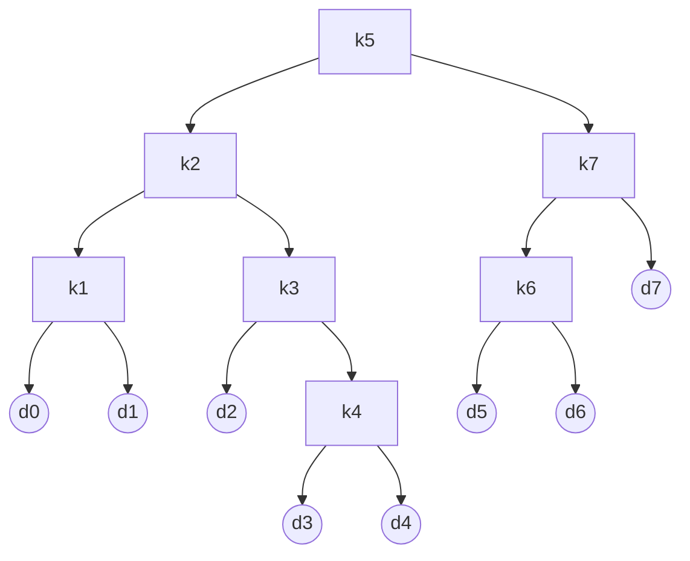

---
export_on_save:
    puppeteer: true
---
<center>
    算法设计与分析第四章作业<br>
    苏亦凡&emsp;&emsp;计科12班&emsp;&emsp;200111229
</center>

# 1

在一条直线上有 $n$ 堆石子，每堆有一定的数量，每次可以将两堆相邻的石子合并，合并后放在两堆的中间位置，合并的费用为两堆石子的总数。（30分）

求把所有石子合并成一堆的最小花费(定义 $dp[i][j]$ 为第 $i$ 堆石子到第 $j$ 堆合并的最小花费)。 

(1) 写出该问题的递推方程。（10分）  
(2) 有 $5$ 堆石子 ($n=5$)，每堆石子大小分别为 $<1,3,5,2,4>$,求出把所有石子合并成一堆的最小花费(要求写出运算矩阵)。（10分）  
(3) 写出该问题的伪代码。（10分） 

答：

设 $w[i]$ 为第 $i$ 堆石子的数量。设 $p[i][j]$ 为第 $i$ 堆石子到第 $j$ 堆石子的总数量，并规定 $i\le j$ 。即 $ p[i,j]=\sum_i^j w[k] $ 。

(1)

$$ dp[i][j]=
\begin{cases}
    0&,i=j\\
    \min_{i\le k<j}\{ dp[i][k]+dp[k][j]+p[i,j] \}&,i<j
\end{cases} $$

(2)

| $p[1][1]=1$ | $p[1][2]=4$ | $p[1][3]=9$ | $p[1][4]=11$ | $p[1][5]=15$ |
| :---------: | :---------: | :---------: | :----------: | :----------: |
|      \      | $p[2][2]=3$ | $p[2][3]=8$ | $p[2][4]=10$ | $p[2][5]=14$ |
|      \      |      \      | $p[3][3]=5$ | $p[3][4]=7$  | $p[3][5]=11$ |
|      \      |      \      |      \      | $p[4][4]=2$  | $p[4][5]=6$  |
|      \      |      \      |      \      |      \       | $p[5][5]=4$  |

<div STYLE="page-break-after: always;"></div>

| $dp[1][1]=0$ | $dp[1][2]=4$ | $dp[1][3]=13$ | $dp[1][4]=22$ | $dp[1][5]=34$ |
| :----------: | :----------: | :-----------: | :-----------: | :-----------: |
|      \       | $dp[2][2]=0$ | $dp[2][3]=8$  | $dp[2][4]=17$ | $dp[2][5]=28$ |
|      \       |      \       | $dp[3][3]=0$  | $dp[3][4]=7$  | $dp[3][5]=17$ |
|      \       |      \       |       \       | $dp[4][4]=0$  | $dp[4][5]=6$  |
|      \       |      \       |       \       |       \       | $dp[5][5]=0$  |

(3)
伪代码如下，c代码见[附录](#附录)

`merge_stone(n,w[])`
```c{.line-numbers}
for i <- 1 to n do
    p[i][i] <- w[i]
    for j <-i to n do
        p[i][j] <- p[i][j-1]+w[j]

for i <- 1 to n do
    dp[i][i] <- 0
for l <- 2 to n do
    for i <- 1 to n-l+1 do
        j <- i+l-1
        dp[i][j] <- inf
        for k <- i to j - 1 do
            q = dp[i][k] + dp[k + 1][j] + p[i][j]
            if(q < dp[i][j]) then
                dp[i][j] = q
return dp[1][n]
```

# 2

若 $7$ 个关键字的概率如下所示，求其最优二叉搜索树的结构和代价，要求必须写出递推方程。（30分）

|  $i$  |   0    |   1   |   2   |   3   |   4   |   5   |   6   |   7   |
| :---: | :----: | :---: | :---: | :---: | :---: | :---: | :---: | :---: |
| $p_i$ | &emsp; | 0.04  | 0.06  | 0.08  | 0.02  | 0.10  | 0.12  | 0.14  |
| $q_j$ |  0.06  | 0.06  | 0.06  | 0.06  | 0.05  | 0.05  | 0.05  | 0.05  |

答：

递推方程
$$ \begin{aligned}
E(i,j) = \begin{cases}
q_{i-1} &,  j = i - 1; \\
min_{i \le k \le j}\{E(i,r-1) + E(r+1,j) + W(i,j)\} &, j > i.
\end{cases}
\end{aligned} $$

其中

$$ W(i,j) = \sum_{l = i}^j p_l + \sum_{l = i - 1}^j q_l $$


代价为 $3.12$

# 3

编程题：兑换零钱问题（40分）

题目描述：

给定不同面额的硬币 `coins` 和一个总金额 `amount` 。编写一个函数来计算可以凑成总金额所需的最少的硬币个数。如果没有任何一种硬币组合能组成总金额，返回$-1$。（提示：你可以认为每种硬币的数量是无限的）。

示例 $1$:

> 输入: coins = [1, 2, 5], amount = 11  
> 输出: 3  
> 解释: 11 = 5 + 5 + 1

示例 $2$:

> 输入: coins = [2], amount = 3  
> 输出: -1

运用动态规划的思想作答，请写出分析过程和状态转移方程，并用一种语言（最好是 C++ 或 JAVA ）实现你的思路，并保证代码能正确运行，复杂度尽可能低。

答：

## 分析优化解结构

设凑成总金额 $i$ 的最少硬币数为 $dp[i]$ 。设取的最后一枚硬币为第 $j$ 种面额的硬币，面值为 $coins[j]$ 。$dp[i-coins[j ]]$ 为原问题的子问题。

若在问题的优化解中，取到的最后一枚硬币面值为 $coin[j]$ ，有子问题 $dp[i-coins[j ]]$ 必须为优化解，否则将优化解替换该子问题解将得到更优解。

状态转移方程：

$$ dp[i]=
\begin{cases}
    0&,i=0\\
    \min\limits_{0\le j<n}\{ dp[i-coins[j ]]+1 \}&,i>coins[j]
\end{cases} $$

子问题显然具有重叠性。故采用动态规划求解。自底而上求解问题。

代码：

```c{.line-numbers}
int coinChange(int *coins, int coinsSize, int amount)
{
    int inf = amount + 1;
    if (coinsSize == 0 || !coins || amount < 0)
        return -1;
    if (!amount)
        return 0;
    if (coinsSize == 1 && amount % coins[0])
        return -1;

    int *dp = (int *)malloc(sizeof(int) * (amount + 1));
    for (int i = 0; i <= amount; ++i)
        dp[i] = inf;
    dp[0] = 0;

    for (int i = 0; i <= amount; ++i)
    {
        for (int j = 0; j < coinsSize; ++j)
        {
            if (i < coins[j])
                continue;
            if (dp[i] > dp[i - coins[j]] + 1)
                dp[i] = dp[i - coins[j]] + 1;
        }
    }
    return (dp[amount] == inf) ? -1 : dp[amount];
}
```
此题为leetcode原题 [322. 零钱兑换](https://leetcode-cn.com/problems/coin-change/)，提交记录截图如下
<center></center>

<div STYLE="page-break-after: always;"></div>

# 附录

```c{.line-numbers}
int merge_stone(int n, int w[])
{
    int p[n + 1][n + 1];
    int dp[n + 1][n + 1];
    int inf = 10000;
    for (int i = 1; i <= n; ++i)
    {
        p[i][i] = w[i];
        for (int j = i; j <= n; ++j)
            p[i][j] = p[i][j - 1] + w[j];
    }

    for (int i = 1; i <= n; ++i)
        dp[i][i] = 0;
    for (int l = 2; l <= n; ++l)
    {
        for (int i = 1; i < n - l + 1; ++i)
        {
            int j = i + l - 1;
            dp[i][j] = inf;
            for (int k = i; k < j; ++k)
                dp[i][j] = (dp[i][k] + dp[k + 1][j] + p[i][j] < dp[i][j]) ?
                            dp[i][k] + dp[k + 1][j] + p[i][j] :
                            dp[i][j];
        }
    }
    return dp[1][n];
}
```