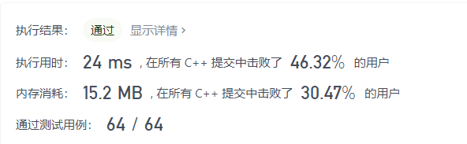
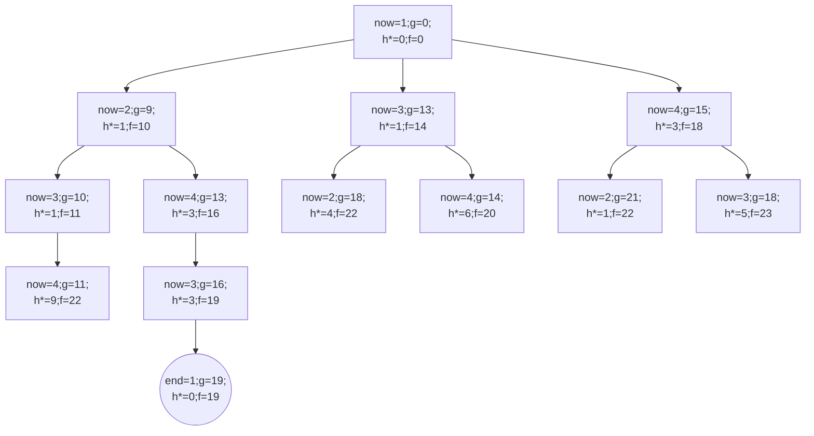

<center>
    算法设计与分析第六章作业<br>
    苏亦凡&emsp;&emsp;计科12班&emsp;&emsp;200111229
</center>

## 1

用本章知识解决下面的问题，写出你的思路和伪代码。

在商店中，有许多在售的物品。然而，也有一些大礼包，每个大礼包以优惠的价格捆绑销售一组物品。现给定每个物品的价格，每个大礼包包含物品的清单，以及待购物品清单。请输出确切完成待购清单的最低花费。每个大礼包由一个数组中的一组数据描述，最后一个数字代表大礼包的价格，其他数字分别表示内含的其他种类物品的数量。任意大礼包可无限次购买。

示例 $1$:

> 输入: $[2,5], [[3,0,5],[1,2,10]], [3,2]$  
> 输出: $14$  
> 解释:   
> 有 $A$ 和 $B$ 两种物品，价格分别为 $¥2$ 和 $¥5$。  
> 大礼包 $1$，你可以以 $¥5$ 的价格购买 $3A$ 和 $0B$。  
> 大礼包 $2$， 你可以以 $¥10$ 的价格购买 $1A$ 和 $2B$。  
> 你需要买 $3$ 个 $A$ 和 $2$ 个 $B$， 所以你付了 $¥10$ 购买了 $1A$ 和 $2B$ （大礼包 $2$），以及 $¥4$ 购买 $2A$。
示例 $2$:

> 输入: $[2,3,4], [[1,1,0,4],[2,2,1,9]], [1,2,1]$  
> 输出: $11$  
> 解释:   
> $A$，$B$，$C$ 的价格分别为 $¥2$，$¥3$，$¥4$.  
> 你可以用 $¥4$ 购买 $1A$ 和 $1B$ ，也可以用 $¥9$ 购买 $2A$，$2B$ 和 $1C$。  
> 你需要买 $1A$，$2B$ 和 $1C$，所以你付了 $¥4$ 买了 $1A$ 和 $1B$ （大礼包 $1$），以及 $¥3$ 购买 $1B$ ， $¥4$ 购买 $1C$。  
> 你不可以购买超出待购清单的物品，尽管购买大礼包 $2$ 更加便宜

> 说明:  
>  最多 $6$ 种物品， $100$ 种大礼包。  
>  每种物品，你最多只需要购买 $6$ 个。  
>  你不可以购买超出待购清单的物品，即使更便宜。

leetcode 原题: [大礼包](https://leetcode-cn.com/problems/shopping-offers/)

解：

### 思路

1. 首先去掉不合理的大礼包，即金额超过单买以及数额超过所需的礼包。
2. 接着对问题进行先深遍历。即尝试所有剩下的大礼包。由于我们已经排除了不合理的大礼包，故购入大礼包必然合理。
3. 分析搜索：一共只有6种物品，故最多有 $6^6=46656$ 种不同的购物清单，故可进行暴力搜索。


### 伪代码

```c
for s[] in special[][]
    for i =0 to len(price) - 1
        if(a[i]>need[i]) do
            从special中除去a[i]
min <- 0
for i = 0 to i len(price) - 1 do
    min += price[i]*needs[i]

begin dfs//进行先深遍历
if(min>l_dfs) do //dfs为此次遍历得到的值
    min <- l_dfs
next dfs
return min
```
### 优化

实际操作中可用记忆化搜索进行优化，优化后的代码在leetcode的测试截图如下



## 2

给定一个 $4$ 个点的连通有向图，其邻接矩阵如下：

$$
\begin{bmatrix}
  \infty & 9 & 13 & 15 \\
  2 & \infty & 1 & 4 \\
  3 & 5 & \infty & 1 \\
  9 & 6 & 3 & \infty \\
\end{bmatrix}
$$
使用 $A^*$ 算法求这个图的旅行商问题。

(1) 请写出你的 $g(n)$ 和 $h^*(n)$ 的定义。

(2) 画出求解此图的搜索树。

答：

### (1)

- $g(n)$: 沿着当前路径从起点到 $n$ 点的路径长度。
- $h^*(n)$ : $n$ 点到不会导致部分成环的点的最短边长。

### (2)

